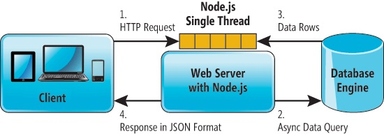

# God Answers Your Questions

On the web there are currently a lot of applications and gimmicks which are made use algorithmic change and javascript.
I have tried to reinvent one such application called as Peter Answers. In which the input text on the html file plays
a key role in tricking the user about the possiblities of the app.


---

## Set up the development environment
To setup the complete web app following steps are used -
1. Download and install [nodejs](https://nodejs.org/en/download/).
2. Download the entire project directory to your computer.
3. Navigate to the project directory. e.g. `$ cd .`
4. Install all nodejs dependencies by running the command `npm install`.
5. Download and install MySQL server. (Check install notes)

---

## Overview
The web application is structured in such a way that the `index.js` in the home directory acts a server.
The frontend code is mainly present in the `mihirspeaks` directory. It includes `first.js` file which is the key
behind the app's magic. `index.html` includes the main frontend file.

File Structure:



## Nodejs Setup
Node.js is an open-source, cross-platform JavaScript run-time environment that executes JavaScript code server-side.
Node.js has an event-driven architecture capable of asynchronous I/O. These design choices aim to optimize throughput
and scalability in web applications with many input/output operations, as well as for real-time Web applications.
In Nodejs we have used Express library which helps in REST-Based optimized code implementation of CallBack functions.
Backend is also connected with MySql Server which queries the questions and answers.
```
$ node index.js"
```
The following libraries are being used by the nodejs server
```js
const http = require('http');
const qs =require('querystring')
const mysql = require('mysql');
const fs = require('node-fs');
```

***
SQL injection is also prevented for any interactions with the sql database. This is done by parameterized sql query -

```js
connection.query('SELECT * FROM query WHERE id = ?',[id], function (error, results, fields) {});
```
The `?` is replaced by the exact string that is entered by the user, therefore no special character interpretation works, instead the exact input is used as it is for the query. This prevents SQL injection attacks.

// Create connection to MySQL database with given details
var connection   = mysql.createConnection({
  host     : 'localhost',
  user     : 'root',
  password : 'helloworld123',
  database : 'comments'
});


## Frontend
We will be using Html Css and Javascript for the frontend.We have used JQuery since it is fast, small, and feature-rich JavaScript library.
It makes things like HTML document traversal and manipulation, event handling, animation, and Ajax much simpler
with an easy-to-use API that works across a multitude of browsers.Finlly, Ajax will make the query request Asynchronous
and thus improve the latency of the application.

## Jquery Magic
The thing that makes this website of what it is, is the jquery code. Because of library callback function to get keypress before
it is pressed allows us to output the text on the input text as per our choice.Thus by using the following callback function we 
are able to get of what is being pressed
```js
$(".check").keydown(function (event) {
    setInterval(function () {
        var value = $('.check').val();
        var arr = value.split('');
        size = arr.length;
        if(check){
            $(".check").val(textSamp.substr(0,size));
        }
    },1);
    
 ```
We immediately use this `arr` value to update the input text with the static code.
```js
 $(".check").val(textSamp.substr(0,size));
```

## MySQL Database
We will be storing the login details and Ethereum addresses of all eligible voters in a MySQL Database. Please check the install notes for steps to install and start the MySQL server.

Access the server by running `mysql -u root -p` from the command line and then entering the password for the Db.

Next, run the following commands to create a database and to make it active.

```SQL
CREATE DATABASE comments;
USE comments;
```

Now, we'll create the table.

```SQL
CREATE TABLE questions(
	id char(9) PRIMARY KEY auto_increment,
	question varchar(100)  NOT NULL,
	answer varchar(100)  NOT NULL,
```

```SQL
INSERT into users values('id', 'first_name', 'last_name', 'password', 'ethereum_address');
```
The table will also be incremented dynamically from the index.js server file from query retrieved using GET /.


***


## Deploy the Application

* Run the ``index.js`` code using `node index.js` and you are good to go.

***

## Install notes

### MySQL Server
#### Install Homebrew
* Installing Homebrew is effortless, open Terminal and enter :  
 `$  /usr/bin/ruby -e "$(curl -fsSL https://raw.githubusercontent.com/Homebrew/install/master/install)"`
* **Note:** Homebrew will download and install Command Line Tools for Xcode as part of the installation process.
* Install **brew services**: `$ brew tap homebrew/services`

#### Install and set up MySQL
* To install MySQL enter : `$ brew install mysql`
* Load and start the MySQL service : `$ brew services start mysql`.   

* Open Terminal and execute the following command to set the root password:  
`mysqladmin -u root password 'yourpassword'`

***


